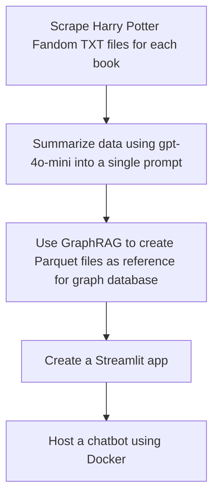

# Harry Potter Hebrew Project with GraphRAG - Entity Extraction and Relationship Analysis


## Overview

This project focuses on extracting entities and their relationships from Hebrew text, specifically using a portion of the Harry Potter story. The goal is to use NLP techniques to identify entities such as characters, magical objects, places, events, and institutions from a given Hebrew text and to analyze relationships between those entities. The data is then stored in a Neo4j graph database for further analysis.

## Project Stages

## Project Structure

```bash
.
├── README.md                   # Project documentation
├── app                         # Streamlit app directory
│   ├── Dockerfile              # Dockerfile for hosting the app
│   ├── api.py                  # Main app script
│   ├── app_requirements.txt    # App-specific dependencies
│   └── inputs                  # Inputs for the app
├── config                      # Configuration files
│   └── __init__.py             
├── data                        # Data folder containing processed text files
│   └── processed
│       ├── graphrag_input.txt  # Concise summary generated from books
│       ├── harry_potter1.txt   # Book 1 text file
│       ├── harry_potter2.txt   # Book 2 text file
│       ├── harry_potter3.txt   # Book 3 text file
│       ├── harry_potter4.txt   # Book 4 text file
│       ├── harry_potter5.txt   # Book 5 text file
│       ├── harry_potter6.txt   # Book 6 text file
│       └── harry_potter7.txt   # Book 7 text file
├── notebooks                   # Jupyter notebooks for experimentation
│   ├── graphrah_to_neo4j.ipynb # GraphRAG to Neo4j notebook
│   └── txt_to_graphrag.ipynb   # Text to GraphRAG processing notebook
├── requirements.txt            # General project dependencies
├── src                         # Source code
│   ├── api.py                  # Main app script
│   ├── data_processing          # Data processing utilities
│   │   ├── scraper.py          # Scraping script for Harry Potter fandom
│   │   └── wikipedia_api_request.py # Script for API requests
│   └── graphrag_import_neo4j_cypher.py # Script to import data into Neo4j
└── tests                       # Test scripts
    └── __init__.py
```

## How GraphRAG Works?
GraphRAG combines the power of Large Language Models (LLMs) with structured knowledge representation to provide more comprehensive and contextually rich responses to complex queries.

## How It Works

1. **Knowledge Graph Construction**
   - Automatically extracts entities and relationships from text documents
   - Uses an LLM to create a structured knowledge representation

2. **Hierarchical Clustering**
   - Organizes entities and relationships into semantic "communities"
   - Creates multi-level abstractions of related topics

3. **Community Summarization**
   - Generates summaries for each community using an LLM
   - Provides a hierarchical overview of the dataset's themes

4. **Query Processing**
   - Maps incoming queries to relevant contexts within the knowledge graph

5. **Context Enrichment**
   - Augments query context with relevant entities and relationships from the graph

6. **Response Generation**
   - Utilizes an LLM to generate comprehensive responses based on the enriched context

## prerequisites
to run llms localy - make sure to download:
**[LLM Studio](https://lmstudio.ai/)**
**[Ollama](https://ollama.com/)**
**download the following model on LLM Studio and serve it: RinaChen/nomic-embed-text-v1.5-Q4_K_M-GGUF/nomic-embed-text-v1.5-q4_k_m.gguf**
**download the following model on Ollama and serve it: ```bash ollama run llama3:8b``` & for embedding: ```bash ollama pull nomic-embed-text```  **

## Setup Instructions
1. Clone the Repository
```bash
git clone https://github.com/your-username/harry-potter-graphrag-hebrew.git
cd harry-potter-graphrag-hebrew
```
2. Set Up a Python Virtual Environment
```bash
python3 -m venv .venv
source .venv/bin/activate  # On Windows use `.venv\Scripts\activate`
```
3. Install the Required Python Packages
```bash
pip install -r requirements.txt
```
4. Set Up Environment Variables
Create a `.env` file in the project root directory and add the following environment variables:
```bash
NEO4J_URI=your_neo4j_uri
NEO4J_USERNAME=your_neo4j_username
NEO4J_PASSWORD=your_neo4j_password
GRAPHRAG_API_KEY=your_openai_api_key
OPENAI_API_KEY=your_openai_api_key
GROQ_API_KEY=your_groq_api_key
```
5. Running the the scraper.py script
To run the scraper, extract text - execute following command:
```bash
python src/data_processing/scraper.py
```

This script will:

	•	scrape the harry potter fandoms for each book
    •	extract the text from the fandoms
    •	save the text in the data/processed directory

6. Expiriment with different LLM's and creating the GraphRAG artifacts: running the notebook - txt_to_graphrag.ipynb
To run the notebook, execute the following command:
```bash
jupyter notebook notebooks/txt_to_graphrag.ipynb
```
7. to run the chatbot - run the following command (make sure you move the parquet file from GraphRAG TO app/inputs directory):
   • go to the app directory:
      ``` cd app```
    • Build the Docker image:
     ```docker build -t streamlit-graphrag-app .```
    • Run the container with a volume mount:
        ```docker run -p 8501:8501 \
  -v /path/on/host/to/inputs:/app/inputs \
  -e GROQ_API_KEY=your_groq_api_key \
  -e GRAPHRAG_API_KEY=your_graphrag_api_key \
  streamlit-graphrag-app```   
   Replace /path/on/host/to/inputs with the actual path on your host machine where your parquet files are stored.


## Prompts
The prompts directory contains the text prompts used for entity extraction via NLP models. The entity_extraction_hebrew.txt prompt extracts entities and relationships from Hebrew text, which are then parsed and stored in the Parquet files.

## License
This project is licensed under the MIT License. See the LICENSE file for more information.
