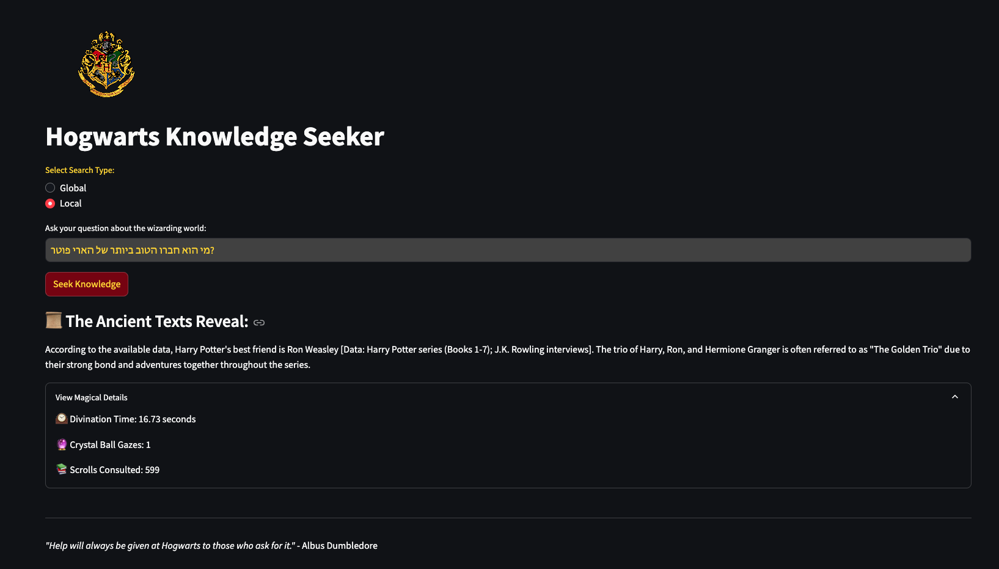
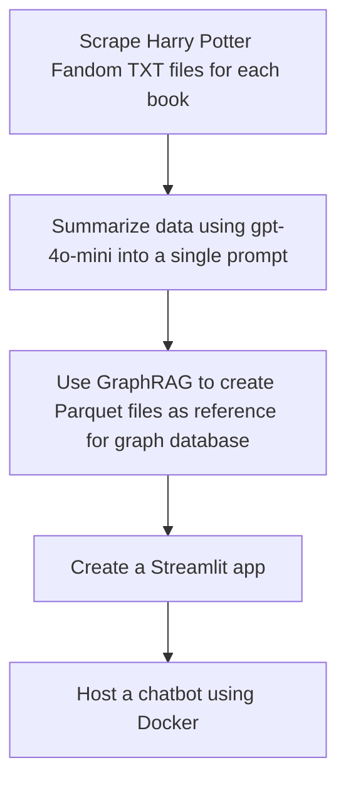
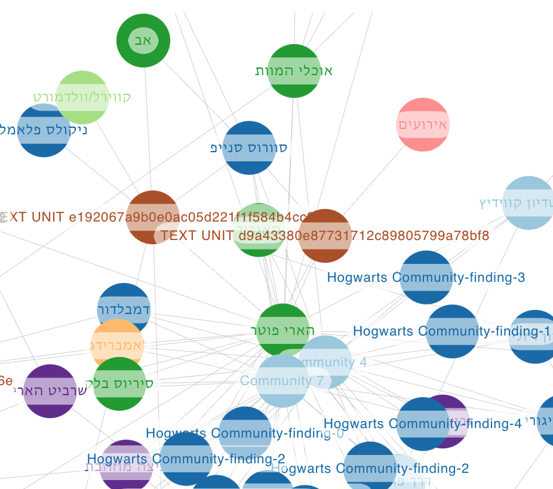

# Harry Potter Hebrew Project with GraphRAG - Entity Extraction and Relationship Analysis


## Overview

This project focuses on extracting entities and their relationships from Hebrew text, specifically using a portion of the Harry Potter story. The goal is to use NLP techniques to identify entities such as characters, magical objects, places, events, and institutions from a given Hebrew text and to analyze relationships between those entities. The data is then stored in a Neo4j graph database for further analysis.



## Project Stages

## Project Structure

```bash
.
├── app/                             # Main application folder
│   ├── api_ollama.py                # Ollama API wrapper
│   ├── app_requirements.txt         # Application-specific dependencies
│   ├── chat.py                      # Chat functionality for the app
│   ├── constants.py                 # Constants used across the app
│   ├── hogwarts_logo.png            # Hogwarts-themed logo for the app
│   ├── ollama_wrapper.py            # Wrapper for the Ollama LLM API
│   ├── settings.py                  # Configuration settings for the app
│   └── inputs/                      # Input data for the app (parquet files)
│       ├── create_final_entities.parquet
│       ├── create_final_relationships.parquet
│       └── lancedb/                 # LanceDB database for embeddings
├── data/                            # Data folder
│   └── processed/                   # Processed Harry Potter summaries
│       ├── harry_potter1.txt
│       ├── harry_potter2.txt
│       ├── graphrag_input.txt
├── media/                           # Media assets
│   ├── app_screenshot.png           # Screenshot of the application UI
│   ├── hogwarts_logo.png            # Hogwarts logo for branding
├── notebooks/                       # Jupyter notebooks for data exploration
│   ├── graphrah_to_neo4j.ipynb      # GraphRAG to Neo4j conversion
│   └── txt_to_graphrag.ipynb        # TXT to GraphRAG conversion process
├── src/                             # Source code for utilities and data processing
│   ├── app.py                       # Main app entry point for the project
│   └── data_processing/             # Data processing scripts
│       ├── scraper.py               # Wikipedia scraper
│       └── wiki_to_text.py          # Convert Wikipedia content to text
├── Dockerfile                       # Docker setup for the app
├── docker-compose.yml               # Docker Compose for multi-container setup
├── README.md                        # Project documentation (this file)
├── requirements.txt                 # Project dependencies
└── tests/                           # Unit tests for the project
    └── __init__.py
```

## How GraphRAG Works?
GraphRAG combines the power of Large Language Models (LLMs) with structured knowledge representation to provide more comprehensive and contextually rich responses to complex queries.

## How It Works

1. **Knowledge Graph Construction**
   - Automatically extracts entities and relationships from text documents
   - Uses an LLM to create a structured knowledge representation

2. **Hierarchical Clustering**
   - Organizes entities and relationships into semantic "communities"
   - Creates multi-level abstractions of related topics

3. **Community Summarization**
   - Generates summaries for each community using an LLM
   - Provides a hierarchical overview of the dataset's themes

4. **Query Processing**
   - Maps incoming queries to relevant contexts within the knowledge graph

5. **Context Enrichment**
   - Augments query context with relevant entities and relationships from the graph

6. **Response Generation**
   - Utilizes an LLM to generate comprehensive responses based on the enriched context

## prerequisites
to run llms localy - make sure to download:
**[LLM Studio](https://lmstudio.ai/)**
**[Ollama](https://ollama.com/)**
**download the following model on LLM Studio and serve it: RinaChen/nomic-embed-text-v1.5-Q4_K_M-GGUF/nomic-embed-text-v1.5-q4_k_m.gguf**
**download the following model on Ollama and serve it: ```bash ollama run llama3:8b``` & for embedding: ```bash ollama pull nomic-embed-text```  **

## Setup Instructions
1. Clone the Repository
```bash
git clone https://github.com/your-username/harry-potter-graphrag-hebrew.git
cd harry-potter-graphrag-hebrew
```
2. Set Up a Python Virtual Environment
```bash
python3 -m venv .venv
source .venv/bin/activate  # On Windows use `.venv\Scripts\activate`
```
3. Install the Required Python Packages
```bash
pip install -r requirements.txt
```
4. Set Up Environment Variables
Create a `.env` file in the project root directory and add the following environment variables:
```bash
NEO4J_URI=your_neo4j_uri
NEO4J_USERNAME=your_neo4j_username
NEO4J_PASSWORD=your_neo4j_password
GRAPHRAG_API_KEY=your_openai_api_key
OPENAI_API_KEY=your_openai_api_key
GROQ_API_KEY=your_groq_api_key
```
5. Running the the scraper.py script
To run the scraper, extract text - execute following command:
```bash
python src/data_processing/scraper.py
```

This script will:

	•	scrape the harry potter fandoms for each book
    •	extract the text from the fandoms
    •	save the text in the data/processed directory

6. Expiriment with different LLM's and creating the GraphRAG artifacts: running the notebook - txt_to_graphrag.ipynb
To run the notebook, execute the following command:
```bash
jupyter notebook notebooks/txt_to_graphrag.ipynb
```
## Notes

- Make sure Ollama is running and accessible at `http://localhost:11434` before starting the application.
- Make sure LM Studio is running and accessible at `http://localhost:1234` before starting the application.

7. install the app requirements:
```bash
pip install -r app/app_requirements.txt
```
8. Running the Application - Open two terminal windows or tabs.
In the first terminal, start the API server:
```bash
cd app
python api_ollama.py
```
In the second terminal, start the Streamlit app:
```bash
cd app
streamlit run chat.py
```

and then you can chat with the API using the Streamlit app at: http://localhost:8501
additionally, you can run the following command to run the API locally at : http://127.0.0.1:8000/docs

## Graph Visualisation
after running the container you can see the graph visualisation at [GraphRAG Visualizer](https://noworneverev.github.io/graphrag-visualizer/)


## Prompts
The prompts directory contains the text prompts used for entity extraction via NLP models. The entity_extraction_hebrew.txt prompt extracts entities and relationships from Hebrew text, which are then parsed and stored in the Parquet files.

## License
This project is licensed under the MIT License. See the LICENSE file for more information.
