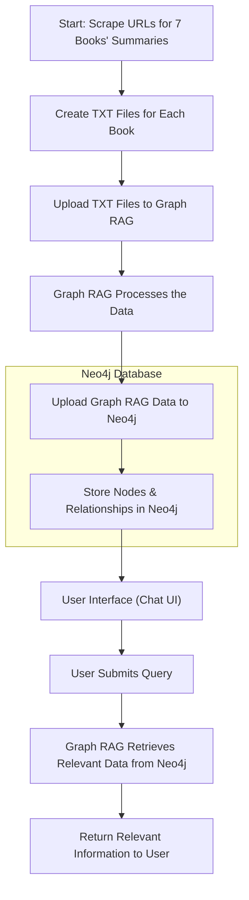

# Harry Potter Hebrew Entity Extraction Project

## Overview

This project focuses on extracting entities and their relationships from Hebrew text, specifically using a portion of the Harry Potter story. The goal is to use NLP techniques to identify entities such as characters, magical objects, places, events, and institutions from a given Hebrew text and to analyze relationships between those entities. The data is then stored in a Neo4j graph database for further analysis.

## Project Structure


```bash
graph TD;
    root["Project Root"]
    root --> README["README.md"]
    root --> config["config"]
    config --> config_init["__init__.py"]
    root --> data["data"]
    data --> processed["processed"]
    data --> raw["raw"]
    root --> notebooks["notebooks"]
    notebooks --> notebooks_init["__init__.py"]
    notebooks --> graphrah["graphrah_to_neo4j.ipynb"]
    root --> rag["rag"]
    rag --> cache["cache"]
    rag --> cache_new["cache_new"]
    rag --> input["input"]
    rag --> output["output"]
    rag --> prompts["prompts"]
    rag --> settings["settings.yaml"]
    root --> requirements["requirements.txt"]
    root --> src["src"]
    src --> src_init["__init__.py"]
    src --> pycache["__pycache__"]
    src --> data_processing["data_processing"]
    src --> graphrag_import["graphrag_import_neo4j_cypher.py"]
    src --> utils["utils"]
    root --> tests["tests"]
    tests --> tests_init["__init__.py"]
```

### Chat Flowchart:

## Key Features
	•	Entity Extraction: Uses NLP models and custom prompts to extract Hebrew entities from text.
	•	Entity Types: Supports the extraction of several entity types:
	•	דמויות (Characters)
	•	חפצים קסומים (Magical Objects)
	•	מקומות (Places)
	•	אירועים (Events)
	•	מוסדות (Institutions)
	•	Relationship Extraction: Identifies relationships between entities and scores them based on strength.
	•	Neo4j Integration: Extracted data is imported into a Neo4j graph database, enabling further analysis and exploration of the relationships between entities.

## Setup Instructions
1. Clone the Repository
```bash
git clone https://github.com/your-username/harry-potter-graphrag-hebrew.git
cd harry-potter-graphrag-hebrew
```
2. Set Up a Python Virtual Environment
```bash
python3 -m venv .venv
source .venv/bin/activate  # On Windows use `.venv\Scripts\activate`
```
3. Install the Required Python Packages
```bash
pip install -r requirements.txt
```
4. Set Up Environment Variables
Create a `.env` file in the project root directory and add the following environment variables:
```bash
NEO4J_URI=your_neo4j_uri
NEO4J_USERNAME=your_neo4j_username
NEO4J_PASSWORD=your_neo4j_password
GRAPHRAG_API_KEY=your_openai_api_key
```
5. Running the Pipeline
To run the pipeline, execute the following command:
```bash
python src/main.py
```

This script will:

	•	Load the extracted entities and relationships from the Parquet files.
	•	Import the data into the Neo4j database.
	•	Apply any necessary constraints and indexes.

6. Viewing the Data in Neo4j
Open your Neo4j browser (either local or cloud-based).
	2.	Run queries to explore the graph database.

For example, to view all characters (דמויות):
```cypher
MATCH (e:__Entity__)
WHERE e.type = 'דמויות'
RETURN e.name, e.description
```

## Prompts
The prompts directory contains the text prompts used for entity extraction via NLP models. The entity_extraction_hebrew.txt prompt extracts entities and relationships from Hebrew text, which are then parsed and stored in the Parquet files.

## License
This project is licensed under the MIT License. See the LICENSE file for more information.
